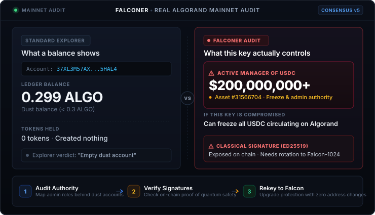

<div align="center">

# Falqoner

**Post-quantum readiness for Algorand.**

[](LICENSE)
[](https://www.typescriptlang.org/)

<p align="center">
  <b>On 2026-09-21, a MainNet account holding 0.3 ALGO was the manager of USDC.</b><br>
  Map what an Ed25519 key really controls — then, when you choose to, move that control to Falcon-1024 without changing the address.
</p>

[In Plain English](#in-plain-english) • [Try It](#try-it) • [Strategy](#strategy-audit-today-migrate-when-ready) • [CLI Reference](#cli-reference) • [Technical Deep Dive](#technical-deep-dive-for-engineers--auditors) • [Limitations](#limitations) • [Security](SECURITY.md) • [Contributing](CONTRIBUTING.md)

---

<p align="center">
  <br>
  <sub>An illustration drawn from a MainNet reading on 2026-09-21. It is historical, not current evidence, and its dollar figure and "Consensus v5" label are not verified here; <a href="#option-b-the-2-minute-terminal-demo">the demo</a> reproduces its point from fixed records.</sub>
</p>

</div>

---

## In Plain English

A crypto account has a key. Whoever holds the key controls the account.

The catch is that a key can control far more than the money sitting in it. On Algorand the same key might also be able to **freeze a currency**, **reconfigure administrators**, or **run a smart contract that holds other people's funds**. None of that shows up in a balance.

So *"this account only has dust in it, it does not matter"* can be badly wrong. The example above was real when read from MainNet on 2026-09-21: account [`37XL3M57AXBUJARWMT5R7M35OERXMH3Q22JMMEFLBYNDXXADGFN625HAL4`](https://allo.info/account/37XL3M57AXBUJARWMT5R7M35OERXMH3Q22JMMEFLBYNDXXADGFN625HAL4) held **0.299 ALGO**, held no tokens, and had created no assets — yet it was the active **manager of USDC** (asset `31566704`). Its address is off the Ed25519 curve, so it is a multisig, logic-signature, application or post-quantum address, not a bare Ed25519 key: `falqoner inspect` shows that offline, and only a ledger record can say which. The chain can change: `npm run demo -- --live` reads public MainNet again, and what it prints is whatever the ledger says then.

Falqoner answers two questions about any Algorand account:

1. **If someone compromised this key, what could they actually do, and to whom?**
2. **Has this account rotated to a quantum-resistant Falcon-1024 signature, and what evidence establishes that?**

Answering them only reads public ledger data: the audit in the web app, and the CLI's `scan`, `plan`, `verify` and `inspect`, never ask for a key or recovery phrase, sign, or submit anything, on any network. Secrets appear in exactly two places, both explicit. `falqoner keygen` prints a new recovery phrase, and the web app's migration panel generates one in the page and, on TestNet and LocalNet only, asks for the 25-word phrase of the key that signs the rekey. See [Auditing vs. Signing](#auditing-vs-signing).

---

## Try It

Testing an invitation, or contributing? Start with [CONTRIBUTING.md](CONTRIBUTING.md): which revision to check out, the checks to run, and how to report a problem.

**Names.** Falqoner is the project's public name. The command is `falqoner`, and the workspace packages are `@falqoner/core`, `@falqoner/cli` and `@falqoner/web`. None of them is published to a package registry. The development name, Falconer, remains in a few places until a later refresh: the web app's title and text, messages such as "not verified by Falconer", the demo script and its recordings (which show `$ falconer`), and core's `FalconerClients` type. The browser's migration record and tab lock also keep their names, so a record saved before the rename still resumes. Packages named `falconer` or `@falconer/...` on the public npm registry belong to other projects, so do not install anything by those names from it.

Both options need Node 22.13+ or Node 24, with the npm it ships ([toolchain](docs/LOCAL_TESTING.md#toolchain)).

### Option A: The Visual Web App (Recommended for Quick Evaluation)

Run the client-side dashboard with interactive risk gauges, authority graphs, and one-click pre-flight checks:

```bash
npm ci
npm run dev
# Open http://localhost:5173
```

No build step is needed first: the dev server compiles the core library from source. A scan reads the network you pick (MainNet by default) through the endpoints listed in [SECURITY.md](SECURITY.md#what-falqoner-checks-and-what-it-trusts).

The browser can also run a full migration, including execution, on LocalNet or TestNet; the LocalNet integration suite exercises that ceremony against a real node, and no TestNet run is recorded here. It is experimental. Migration handles recovery material in the page: the new Falcon key and its 25-word phrase are generated there, and the current signing key's phrase is typed in to sign the rekey. Both stay in the page's memory and only signed transactions are sent. Before each transaction is sent, the page saves a public record of it in the browser (its id, network, addresses and validity window, never a phrase or key), so a reload finds an unfinished migration, reads the ledger to settle what happened, and continues only after the new key's 25 words are typed in again. Before anything is sent, the page shows a budget read from the network: each step's fee and who pays it, the transfer to the new address (only what it lacks for its minimum balance and its proof), and what each address keeps. Migrating or continuing approves that budget; before each step it is read again, and a step that would cost more, or that the account can no longer afford, is not sent. MainNet execution is deliberately not offered in the page: a MainNet key should never be entered into a browser. The plan is produced there, and signing belongs in your wallet.

### Option B: The 2-Minute Terminal Demo

Runs four real CLI commands against a fixed ledger: no network, no keys, no Docker, and the same output on every run. The ledger is a fixture ([`fixture-ledger.mjs`](packages/cli/test/fixture-ledger.mjs)) answering for LocalNet with the CLI's offline traps loaded, and the demo says so on screen.

```bash
npm ci && npm run build
npm run demo              # the fixed ledger: offline and reproducible
npm run demo -- --live    # the same commands, read-only, against public MainNet
```

1. **A balance tells you almost nothing:** in the fixture, an account holding 0.3 ALGO manages an asset whose clawback is live, and the scan reports that it can seize that asset from any holder.
2. **Off-curve is not post-quantum:** `inspect` on a hash-derived address says what its shape rules out, a bare Ed25519 key, and that it cannot tell a multisig from a post-quantum key.
3. **The verdict comes from a record, not a shape:** `verify` names that address a classical multisignature from the confirmed record the fixture holds. Exit 2, because only post-quantum authority established by a confirmed Falcon-1024 record exits 0.
4. **Exposure is gateable:** the same scan exits 2 at an exposure threshold, so a CI pipeline can fail on high exposure rather than filing a report nobody reads.

Each command's exit code is printed with its meaning. With `--live`, the narration says only what each command does: what it finds is whatever MainNet says at the time, and a failed read is reported as a failure, with the demo exiting 1.

The recording is made from the fixture run, so it is reproducible byte for byte:

```bash
npm run record              # rewrites docs/terminal.svg and docs/terminal.cast
npm run record -- --check   # fails if they no longer match what the demo prints; npm test runs it
asciinema play docs/terminal.cast
```

---

## Strategy: Audit Today, Migrate When Ready

Algorand supports post-quantum accounts secured by **Falcon-1024** signatures. They are part of the **v42 consensus upgrade**, shipped in **algod 5.0.0**, and a network accepts them only once that upgrade has taken effect there. Falqoner reads the protocol a node reports before it prices or signs anything.

**Most accounts should not rekey today.** Algorand's own guidance is that migration is forward-looking:
- No quantum computer capable of threatening Ed25519 is known to exist.
- A Falcon-1024 signature adds **twice the base fee**, so a Falcon-signed transaction needs at least 0.003 ALGO where an Ed25519-signed one needs 0.001 ALGO. When the network is congested, fees are charged by transaction size, and a Falcon signature and public key add about 3 kB.
- After a rekey, every transaction from the account must be Falcon-signed, and not every wallet, SDK or tool supports that yet. Migrating early could lock you out of tooling you rely on.

Sources: Algorand's [post-quantum accounts](https://dev.algorand.co/concepts/accounts/post-quantum/) and [transaction fees](https://dev.algorand.co/concepts/transactions/fees/) documentation, read 2026-09-29.

**What you should do today is audit your exposure.** An Ed25519 account's address is its public key, so that key is public as soon as the address is, and an attacker can record public keys now and try to forge signatures with them later. Falqoner lets you audit your entire portfolio so that when migration is warranted, **rekeying is an informed operational decision, not an emergency scramble**.

---

## CLI Reference

`scan`, `plan`, `verify` and `inspect` are read-only on every network, MainNet (the default) included. They never load a key or recovery phrase, sign, or submit a transaction. `keygen` is the one command that produces a secret. There is no migrate command.

The examples run the built CLI, so run `npm ci && npm run build` first. `<ADDRESS>`, `<PQ_ADDRESS>`, `<ASSET_IDS>` and `<APP_IDS>` are placeholders for real values. `scan`, `plan` and `verify` read public MainNet unless you choose another network with `--network` (`-n`). `inspect`, `keygen` and `help` work offline.

```bash
# What does this key actually control?
node packages/cli/dist/index.js scan <ADDRESS> --network mainnet

# Check named assets and apps exactly (comma-separated ids): the answer when you know your own
node packages/cli/dist/index.js scan <ADDRESS> --assets <ASSET_IDS> --apps <APP_IDS>

# Compact summary (ideal for CI logs and terminal previews)
node packages/cli/dist/index.js scan <ADDRESS> --compact

# What would migrating take, and what could go wrong? Sends nothing.
node packages/cli/dist/index.js plan <ADDRESS> --to <PQ_ADDRESS>

# Is this account post-quantum, and on what evidence? (exits 0 only when a
# confirmed Falcon-1024 record establishes it; 2 otherwise, including unconfirmed)
node packages/cli/dist/index.js verify <ADDRESS>

# Gate a treasury in CI: exit code 2 when exposure meets the threshold
node packages/cli/dist/index.js scan <ADDRESS> --fail-on elevated --json

# Create a post-quantum account. SECRET OUTPUT: both formats print the
# recovery phrase, which controls the account. Never run it where the output
# is logged, such as CI, a shared terminal or a recorded session.
node packages/cli/dist/index.js keygen
```

`keygen` cannot check what you wrote down, and no Falqoner command can: the CLI has no command that reads a phrase back, and the web app checks only a key it generates itself. Use a `keygen` address as a `plan --to` target, which only reads, and rekey nothing to it unless you can reproduce the key from your copy of the phrase.

Exit codes, per command:

| Command | `0` | `2` |
| :--- | :--- | :--- |
| `scan` | The report printed. Without `--fail-on` that is whatever it found; with it, a complete verdict under the threshold. | `--fail-on` was met, or could not be evaluated because a check fell short or an application permission is unverified (see [Coverage](#4-coverage-what-a-scan-checked)). |
| `verify` | Post-quantum authority on a confirmed Falcon-1024 record. | Anything else: classical by shape, a multisig or logic-signature record, no record, only rejected records, or history that could not be read. |
| `plan` | No blockers, and a budget priced from the network. | Blocked, or no budget could be priced. |
| `inspect`, `keygen`, `help` | Printed. | — |

Every command exits `1` on a usage error — an unknown command or option, a missing or malformed argument such as an invalid address or `--to`, the removed `verify --mnemonic-env` — or on a failure it could not get past, such as an account read the provider refused or answered with an unusable record. Nothing was judged. Malformed input is refused before any provider is contacted.

`--json` prints JSON alone on stdout, overrides `--compact`, and writes every big integer as an exact decimal string; notices such as the `--fail-on` result go to stderr. Colour is off with `NO_COLOR`; otherwise `FORCE_COLOR` turns it on (`0` or `false` turn it off), and without either each stream is coloured only when it is a terminal.

`verify` once took `--mnemonic-env` to load a Falcon phrase and send a signed proof-of-control transaction. That path is removed: the option is refused before any environment variable is read or any provider is contacted.

---

## Technical Deep Dive (For Engineers & Auditors)

### 1. Evidence, Not Inference

The most dangerous failure mode for a security tool is reporting an account as safe when it is not.

An address off the Ed25519 curve is hash-derived, meaning no bare classical key can produce it. **This does not make it post-quantum.** Multisig and logic-signature addresses are also hash-derived, and both are built from Ed25519 keys. A multisig treasury that looks "off-curve" is just as vulnerable to Shor's algorithm as a standard key.

Falqoner requires **a confirmed record of the authority signing**:

| Classification | Evidence basis | What Falqoner checks itself | Label, in the CLI and the web app |
| :--- | :--- | :--- | :--- |
| `post-quantum` | Provider record: a confirmed transaction with a Falcon-1024 `pqsig` | Scheme, 1793-byte key and salt re-derive the authority address exactly, off the curve | **✔ post-quantum, on a provider-confirmed record** |
| `classical-key` | Address shape: the authority is an Ed25519 curve point | The curve test — exposure only, not the account type | **✖ classical, by address shape: on the Ed25519 curve** |
| `classical-multisig` | Provider record: a confirmed transaction with a multisig | Record structure | **✖ classical multisignature, on a provider-confirmed record** |
| `logicsig` | Provider record: a confirmed transaction with a logic signature | Record structure | **? logic signature, safety unproven** |
| `unknown-hash-derived` | No acceptable record (none found, history limit reached, unavailable, or rejected) | — | **? hash-derived, type unconfirmed**, **? hash-derived, a record rejected**, or **? could not be checked** when the history could not be read or was malformed |

Every view prints the same label from one mapping in core (`authorityVerdict`), and only `verify`'s first row exits 0. A shape alone never names a multisig or a single key, and an authority nothing establishes is never labelled classical.

#### Trust model

Falqoner treats the configured algod/indexer as a **trusted source of confirmed ledger records**. It checks locally that a reported Falcon record is well formed and that its scheme, public key and salt bind to the account's authority address exactly. It does **not** verify the Falcon signature bytes or the transaction payload itself, so a provider that fabricates a coherent record is outside this boundary. Every verdict carries its basis — `evidence.basis`, the provider, transaction and round, and three separate guarantees (`providerConfirmedRecord`, `localAddressBinding`, `independentSignatureVerification`, the last always `false`) — and a malformed, contradictory, unconfirmed or unsupported record is rejected with its reason rather than read as evidence.

The account record a scan starts from is checked before anything is derived from it. It must be for the address asked about, with a usable balance and authority, and must list as many holdings, created assets and apps, and opt-ins as its own totals report. A failed read, a 404 included, or an unusable record ends `scan`, `plan`, `verify` or the web audit with an error, never with a result. A well-formed record is still the provider's word: one that leaves out a real rekey or role is taken as the ledger's answer, and whether a transaction is in the ledger at all is never checked independently.

Only the migration ceremony checks a Falcon signature itself: before the rekey, it reads the confirmed proof back from the node or indexer and verifies its signature against the new key.

### 2. The Safety Ceremony

Rekeying to a key you cannot reproduce permanently freezes an account. Falqoner executes a migration only through one guarded ceremony in its core (`openCeremony`). The web app runs it on TestNet and LocalNet, never MainNet, and the LocalNet suite runs it against a real node. The CLI runs no part of it that signs.

The on-chain steps - funding the new address, its proof, the rekey and the verification - are separate transactions sent one after another, not an atomic group: a run can stop between any two, and the page picks it up again from what the ledger says. Before each step the ceremony checks the node's network, reads the account's authority and the budget again, and refuses any step the ledger has not reached. The rekey goes only after the proof has confirmed for this target on this network. The lower-level functions it is built from are primitives for tests and tooling. The `prepare*` helpers only build a transaction, refusing one that does not match its budget and a rekey to an on-curve address or to the account itself. `fundPqAddress`, `proveControl`, `rekeyToPq` and `verifyMigration` each sign and send one transaction, holding its signature to the budget. None of them orders the steps, requires a confirmed proof before a rekey, limits execution to TestNet and LocalNet, or records an attempt before sending.

1. **Offline Pre-Flight:** Generates Falcon-1024 keypair, validates address is off-curve, and asserts that the 25-word mnemonic re-derives the identical key independently from scratch.
2. **On-Chain Proof of Control:** The new post-quantum address sends a zero-value transaction to itself, and the ceremony verifies the confirmed copy's Falcon signature locally, before anything depends on the new key.
3. **Rekey:** Once the proof has confirmed, submits the rekey transaction referencing the proven Falcon address. All balances, NFTs, app states, and admin roles carry over untouched. Accounts rekeyed *to* this address do not: Algorand checks a signature against the sender's auth-addr directly and never follows that address's own rekey, so they stay signed for by the original key until each gets its own rekey.
4. **End-to-End Verification:** Re-reads on-chain `auth-addr` and exercises signing authority using the new post-quantum key.

> [!WARNING]
> **Account Close-Out Trapdoor:** In Algorand consensus, closing an account out (reducing its balance to 0 with `closeRemainderTo`) deletes its ledger record, including `auth-addr`. If funded again later, the address reverts to being controlled by its original classical Ed25519 key with no warning! ([Algorand: rekeying](https://dev.algorand.co/concepts/accounts/rekeying/), read 2026-09-29.) Falqoner warns about this on every audit of an already-migrated account.

### 3. Two Details That Shape the Checks

Two details that cost real debugging time to reach:

- **Canonical msgpack omits salt 0:** A post-quantum address is `SHA-512/256("PQA" + scheme + salt + pubkey)`, where the salt is the lowest byte making the result off-curve — so it is **0 about half the time**. Algorand's canonical encoding omits zero-valued fields, so those signatures carry no `salt` key at all. Reading it as `Number(undefined)` yields `NaN`. That bug made Falqoner fail to recognise roughly half of all genuinely post-quantum accounts, presenting as a flaky test rather than an obvious error. It is fixed and pinned by regression tests that construct the omitted-salt case directly.
- **A multisig address is off-curve only about half the time:** A post-quantum address is *guaranteed* off-curve, because the salt is chosen precisely to force it there. A multisig, application or logic-signature address is a plain hash with no such construction, so roughly half of them land on the curve and are indistinguishable from a bare public key. Off-curve therefore proves hash-derivation, but on-curve proves nothing — which is why the curve test is used to rule post-quantum *out*, never to rule a classical key *in*.

#### Note on the 3× Fee

With no congestion, a Falcon-signed transaction needs 3,000 µALGO rather than 1,000 µALGO: a Falcon-1024 signature contributes an additional 2× the base fee, and the premium also applies to logic signatures delegated with a Falcon key, not just to top-level `pqsig` transactions ([Algorand: transaction fees](https://dev.algorand.co/concepts/transactions/fees/), read 2026-09-29). It is called out here because it is easy to hit by accident: a tool that takes the minimum fee as 1,000 µALGO builds a Falcon-signed transaction the network will not accept.

Falqoner does not hard-code the figure. Its migration budget prices each step from what the node reports - the minimum fee, the pool's per-byte fee and the consensus protocol - using that protocol's contribution for the step's signature scheme. It bounds the signed length at the largest envelope the signer can produce: a Falcon-1024 signature varies in length, up to 1,423 bytes, beside the 1,793-byte public key. Each signed transaction is checked against its budget before it is sent. A protocol whose rules Falqoner does not encode leaves the budget unavailable rather than guessed.

### 4. Coverage: What a Scan Checked

A score is only as complete as the reads behind it, so every scan reports what each check covered: the CLI's `coverage` section, the web app's "What was searched" panel, and `coverage` in `scan --json`, all from one model.

| Check | What it covers | Bounded by |
| :--- | :--- | :--- |
| `history` | The account's recent transactions, searched for a record of what signs for it. A view of `authority.evidence`, not a second verdict. | The 50 most recent it sent |
| `incoming` | Accounts rekeyed to this address, page by page, and what signs for each. Duplicates are dropped and earlier pages kept if a later one fails. | 1,000 distinct accounts and 10 requests; a repeated continuation token stops it |
| `assets` | Roles on assets it holds and assets named with `--assets`, read exactly, plus the optional `--deep` ledger sample. The sample visits each distinct asset once, never asks a page for more than it still wants, and follows an empty page that points onward rather than taking it as the end. | 250 held and 250 named; `--scan-limit` distinct assets and ⌈limit/1,000⌉+1 requests for the sample |
| `apps` | Global state of applications it created, opted into or named with `--apps`. | 250 applications |

Each check is `complete` (finished its declared scope), `partial` (stopped at a cap, or after a later request failed, keeping what it read), `unavailable` (could not run), `invalid-response` (the provider answered with something unusable) or `not-requested`. A read by id counts only as a record, or for an HTTP 404 as an established absence. Timeouts, other errors and malformed records are never read as "nothing there", and successful reads are counted separately from attempts. A record is usable only when it is for the id asked for and carries what the scan interprets. For an asset, that is its creator, total and decimals, plus any role as an address. For an application, it is its creator and global state in which every entry is a key and a typed value. Sampled asset records get the same checks. Anything else is `invalid-response`, never "no roles". A role or global state that is simply absent is ordinary, and reads as none.

**Applications are references.** On Algorand, creating an application confers nothing by itself, and a program may or may not act on an address it stores. Without analysing programs, Falqoner reports app creation and global-state matches as references with unverified permissions. They add no points, no third-party claim and no promise that a rekey fixes anything, and they keep a verdict from being complete.

**Verdicts follow coverage.** `risk.complete` is true only when every required and requested check finished and no application permission is unverified, and `risk.uncertainties` lists what fell short. Only a complete verdict can be clean ("No exposure found", band `safe`). Otherwise an established band is shown as a lower bound (`42+`, "Elevated exposure, at least"), and a clean-looking one as `?`. `scan --fail-on` exits 2 at the threshold, and whenever an incomplete check means the threshold cannot be evaluated. Checks nobody asked for are a stated scope limit, not a failure. Above all, roles on assets and applications the account neither created, holds, opted into nor named are outside a scan unless sampled: no combination of complete checks is a census of the ledger.

**Reach is stated as found.** `reach` in the JSON, and the reach notice in the CLI and web app, name what the address was found able to do, such as seizing or freezing assets for any holder or signing for accounts rekeyed to it. They say separately whether the key exercising each is established as post-quantum. `risk.systemic` still says whether any reach exists, but is not an alert on its own.

**Scores are heuristics.** The 0–100 score weighs established exposure within the checks listed. It is not a security certification: a zero means nothing exposed was found in what was checked.

Changes to `scan --json` for consumers:

- New: `coverage`, `reach`, `risk.complete`, `risk.uncertainties`, `edges[].basis` and `edges[].protected`, and `appAdminRoles[].permission`.
- `incomingScan` can now also be `partial` or `invalid-response`.
- `roleScan.assetsExamined` and `roleScan.appsExamined` count successful reads, not attempts.
- `roleScan.incomplete` no longer flags a ledger sample that read its full limit.
- Application findings carry `thirdParty: false` and `fixedByRekey: false`.

---

## Architecture & Philosophy

```
falqoner/
├── packages/
│   ├── core/           # Audit engine, graph crawler, Falcon cryptography & pre-flight
│   └── cli/            # The `falqoner` CLI, with CI exit codes & JSON output
├── apps/
│   └── web/            # Client-only browser dashboard with in-WASM Falcon-1024
├── scripts/
│   ├── demo.mjs        # Two-minute demo: fixed ledger by default, --live for MainNet
│   └── record-demo.mjs # Reproducible recorder for docs/terminal.svg & docs/terminal.cast
└── docs/
    ├── demo.svg        # Illustration of a 2026-09-21 MainNet reading (historical)
    ├── terminal.svg    # Animated recording of the fixture demo
    └── terminal.cast   # The same recording, asciicast v2
```

### Auditing vs. Signing
- **Auditing belongs in the CLI and CI:** Scanning, risk scoring, planning, and gating run cleanly in developer terminals. `scan`, `plan`, `verify` and `inspect` only read, on every network, and never load a key or recovery phrase, sign, or submit. An audit that never needs your signing key has nothing to lose on your behalf.
- **Secrets are handled in two explicit places:** `falqoner keygen` prints a new recovery phrase, and its output, JSON included, is a secret. The web app's migration panel generates a Falcon key and its phrase in the page and, on TestNet and LocalNet, takes the 25-word phrase of the key that signs the rekey; neither phrase leaves the page's memory, and only signed transactions are sent. The page keeps a public record of each transaction in browser storage for recovery after a reload, and nothing secret is ever written there.
- **MainNet signing belongs in your wallet:** The CLI accepts no signing key on any network. The web app offers execution only on TestNet and LocalNet, and warns never to paste a MainNet phrase into a web page: a phrase is the same key on every network. `plan` takes public addresses only and prints the steps, blockers and budget as text or JSON. That is a description, not a transaction: nothing Falqoner prints can be imported into or signed by a wallet. A MainNet migration means building and signing each step with wallet tooling you trust, after confirming on TestNet that it can sign the rekey and then sign with the Falcon key.

---

## Testing

There are four suites. The three offline suites need nothing; the integration
suite runs against an AlgoKit LocalNet node (algod 5.0 or later, on a verified
protocol) and fails, rather than skipping, when one is not reachable.

The [CI workflow](.github/workflows/ci.yml) runs them, and counts grow as tests
are added. On 2026-09-29, hosted CI in the development repository passed 719
offline tests on each of Ubuntu 24.04, Windows Server 2025 and macOS 26 with
Node 22.13.0 and 24.0.0, and 36 LocalNet tests; a later local run on Windows 11
with Node 22.15.0 passed 750 offline and 36 LocalNet tests. None was skipped.
CodeQL has not run yet: its job runs only on a public repository.

```bash
# Offline suites: core unit, regression, coverage and cryptographic tests; the
# CLI suite (command dispatch, and the built executable with network and
# secret traps); then the web app's components rendered to markup. No Docker,
# no node.
npm test

# Start a local node explicitly (requires Docker), then check it is ready
npm run localnet:start
npm run localnet:status

# Integration suite against the live node, or every suite in sequence
npm run test:localnet
npm run test:all

# Pack core and the CLI, install the tarballs into a fresh project outside the
# workspace and run them there. Core's dependencies come from the npm registry
# or its cache.
npm run test:package
```

See [Local testing](docs/LOCAL_TESTING.md) for prerequisites, readiness
diagnostics and troubleshooting.

The suite is mostly real: it creates assets, rekeys accounts, signs with Falcon, and asserts against a live node. Highlights:

- **Differential-tests the Edwards25519 point check** against `algosdk`'s own reference implementation over 500 random inputs.
- **Migrates an account holding an ASA**, then asserts the address is unchanged, the asset is still held, the **old Ed25519 key is rejected**, and an **ASA reconfiguration still succeeds under Falcon** — proving the manager role survived.
- **Recovers a migrated account** from the 25-word phrase alone.
- **Asserts an off-curve multisig is never reported as post-quantum**, and that an unused hash-derived authority is reported as unconfirmed rather than safe.

---

## Limitations

Stated plainly, because a security tool that overstates itself is worse than none:

- **A granted asset role cannot be searched for.** Indexer cannot filter assets by manager, clawback or freeze, and it does not index role addresses as participants in the `acfg` that grants them, so there is no query for "assets where this account is clawback". Verified by granting a role to an account and finding nothing from that account’s side. Falqoner therefore finds these roles exactly in the two cases where it can — assets the account created, and assets it holds — and exactly for any asset named with `--assets`. `--deep` sweeps the ledger in id order as a fallback; on MainNet it reads a small fraction of the asset set, so it is reported as a **sample** and a clean result means nothing was found in the sample, not that no roles are held. Every report states what it looked at.
- **Evidence requires the account to have transacted** under its current authority. A freshly rekeyed account that has not moved yet is honestly reported as unconfirmed.
- **Indexer lag** briefly delays the post-quantum verdict after a migration. The rekey takes effect once it is confirmed; only the *evidence* waits.
- **Application references are found, but only where the app can be reached, and their permissions are unverified.** An app that keeps an address in global state is read when this account created it, opted into it, or named it with `--apps`. There is no query for "applications whose state names this address", so an app the account neither created, joined, nor named is not read. Programs are not analysed: a finding establishes that the account created the app, or that the address is in its state under a given key, not that either confers any authority. Such references never add to the score, and they keep the verdict from being complete.
- **Accounts rekeyed to an address are read up to a bound.** The search stops at 1,000 distinct accounts or 10 requests. Past either, it is reported as partial and the verdict as a lower bound, rather than as a complete list.
- **There is no CLI migrate command, by choice.** The terminal can tell you what a key controls and what the ledger records establish about an account's authority; it will not sign, submit or perform a migration. This is a stance, not a gap: an audit that never needs your signing key has nothing to lose on your behalf.
- **A plan is not a transaction.** `plan` takes public addresses only, and nothing it prints is a transaction file a wallet can import or sign. Falqoner is not a wallet: it exports no keys or transactions, and apart from its own migration it never signs for an account. Not every wallet can sign with a Falcon key; check yours on TestNet before relying on it.
- **The browser migration signs with one Ed25519 key.** It refuses an account whose current authority is a multisig, a logic signature or already post-quantum, and it refuses MainNet whatever the endpoint says.
- **A logic signature's safety depends on its program, which Falqoner does not analyse.** Every logic-signature authority is reported as unproven. That includes one delegated with a Falcon key, which is not distinguished from an Ed25519-delegated one: after the v42 upgrade either can sign a delegation, and because Algorand has no post-quantum native multisig, a logic signature is how threshold control of a post-quantum account is built. So a genuinely post-quantum logicsig authority reads as unconfirmed rather than safe.
- **An on-curve hash-derived address cannot be recognised as one.** Half of all multisig and application addresses hash onto the curve, and without an observed signature they read as ordinary classical keys. The verdict that matters — classical, and exposed — is right either way, but the account type is not named.
- **Not audited.** A rekey to a key you cannot reproduce cannot be undone; try the migration on TestNet first. See [SECURITY.md](SECURITY.md) for trust boundaries and recovery limits.

---

## Tech Stack

- `algosdk` 3.7, for post-quantum mnemonics, addresses and signed transactions
- `falcon-1024` 0.2, precompiled WebAssembly; its README says it is built from the C implementation go-algorand uses
- AlgoKit LocalNet with algod 5.0.2, the version the integration suite is verified against
- TypeScript 5.7, React 18, Vite, Vitest

---

## License

MIT © 2026 Falconer Contributors. See [LICENSE](LICENSE) for details.

Dependencies keep their own licenses. The web app's build includes the notices for the code it bundles: [`THIRD_PARTY_NOTICES.md`](apps/web/public/THIRD_PARTY_NOTICES.md) for the Falcon-1024 WebAssembly, and a generated `THIRD_PARTY_LICENSES.md`.
